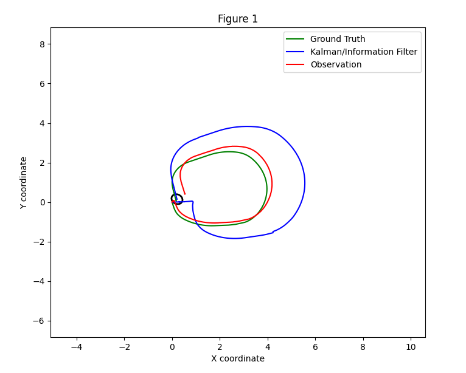

# Memoria de la Práctica 3: Filtro de Kalman Extendido (EKF) en ROS 2

## Descripción

Esta práctica consiste en la implementación de un **Filtro de Kalman Extendido (EKF)** para la estimación de la localización de un robot móvil en movimiento. Se parte de la simulación del robot TurtleBot3 con sensores de odometría e IMU, integrados mediante fusión sensorial. La práctica está dividida en tres modelos de estimación según el estado del robot:

- **Modelo 3D**: posición `(x, y, θ)`
- **Modelo 7D**: posición, velocidad lineal/angular y aceleraciones `(x, y, θ, v, ω, ax, ay)`
- **Modelo 8D**: estado más completo con velocidades descompuestas `(x, y, θ, vx, vy, ω, ax, ay)`

La odometría con ruido se ha usado como observación, y la odometría sin ruido como `ground truth`.

---

## Objetivos de la práctica

- Implementar un EKF para estimar el estado de un robot móvil.
- Utilizar distintos modelos de movimiento y observación.
- Aplicar fusión sensorial con odometría e IMU.
- Comparar el rendimiento de cada modelo frente al `ground truth`.

---

## Modelos desarrollados

### Modelo 3D

Incluye únicamente la posición y la orientación del robot. Representa la cinemática diferencial básica del TurtleBot3.
Los 3 casos estudiados con ruidos son:
- Ruido Inicial Estándar
`proc_noise_std = [0.002, 0.002, 0.001]` 
`obs_noise_std = [1.02, 1.02, 100.01]`

- Alta incertidumbre en la observación
`proc_noise_std = [0.002, 0.002, 0.001] `
`obs_noise_std = [10.0, 10.0, 1000.0]`

- Alta incertidumbre en el modelo de movimiento
`proc_noise_std = [0.1, 0.1, 0.05]`
`obs_noise_std = [1.02, 1.02, 100.01]`

### Modelo 7D

Extiende el modelo anterior añadiendo velocidad y aceleración lineal y velocidad angular, lo que permite fusionar odometría con IMU.

Los ruidos añadidos son:
- Ruido Inicial Estándar
`proc_noise_std = [0.1, 0.1, 0.05, 0.1, 0.1, 0.1, 0.1]`
`obs_noise_std = [100.0, 100.0, 1000.0, 6.853891945200942e-06, 1.0966227112321507e-06, 0.0015387262937311438, 0.0015387262937311438]`

- Alta incertidumbre en la observación
`proc_noise_std = [0.1, 0.1, 0.05, 0.1, 0.1, 0.1, 0.1]`
`obs_noise_std = [1000.0, 1000.0, 10000.0, 6.853891945200942e-05, 1.0966227112321507e-05, 0.015387262937311438, 0.015387262937311438]`

- Alta incertidumbre en el modelo de movimiento
`proc_noise_std = [1, 1, 0.5, 1, 1, 1, 1]`
`obs_noise_std = [100.0, 100.0, 1000.0, 6.853891945200942e-06, 1.0966227112321507e-06, 0.0015387262937311438, 0.0015387262937311438]`

### Modelo 8D

Incluye la descomposición cartesiana de la velocidad y proporciona una estimación más detallada y precisa, útil para trayectorias curvas.

Los ruidos añadidos son:
- Ruido Inicial Estándar
`proc_noise_std = [0.1, 0.1, 0.05, 0.1, 0.1, 0.1, 0.1, 0.1]`
`obs_noise_std = [100.0, 100.0, 1000.0, 6.853891945200942e-06, 1.0966227112321507e-06, 0.0015387262937311438, 0.0015387262937311438]`

- Alta incertidumbre en la observación
`proc_noise_std = [0.1, 0.1, 0.05, 0.1, 0.1, 0.1, 0.1, 0.1]`
`obs_noise_std = [1000.0, 1000.0, 10000.0, 6.853891945200942e-05, 1.0966227112321507e-05, 0.015387262937311438, 0.015387262937311438]`

- Alta incertidumbre en el modelo de movimiento
`proc_noise_std = [1, 1, 0.5, 1, 1, 1, 1, 1]`
`obs_noise_std = [100.0, 100.0, 1000.0, 6.853891945200942e-06, 1.0966227112321507e-06, 0.0015387262937311438, 0.0015387262937311438]`

---

## Comparación de resultados

En todos los modelos se han comparado tres trayectorias:

- **Ground Truth** (verde): posición real sin ruido.
- **Kalman/Information Filter** (azul): estimación del EKF.
- **Observation** (rojo): medida ruidosa del sensor.

La comparación visual permite evaluar la precisión de los modelos frente a las observaciones ruidosas.

---

## Escenarios evaluados

Se han probado tres configuraciones distintas de ruido para observar el comportamiento del EKF:

1. **Caso base**: parámetros por defecto equilibrados.
2. **Alta incertidumbre en la observación**: incremento de la matriz Q.
3. **Alta incertidumbre en el modelo de movimiento**: incremento de la matriz R.

---

## Tareas realizadas

Durante el desarrollo de la práctica se han completado las etiquetas `# TODO` en los siguientes módulos:

- `filters/ekf.py`: funciones `predict()` y `update()`.
- `motion_models/velocity_motion_models.py`: funciones `g(mu, u, dt)`, `G(mu, u, dt)` y `V(mu, u, dt)`.
- `ekf_7d_state_estimation.py` y `ekf_8d_state_estimation.py`: instanciación del filtro EKF y ajuste de parámetros de ruido.

---

## Conclusión

El uso del EKF permite estimar de forma precisa el estado de un robot en movimiento incluso con modelos no lineales y observaciones ruidosas. La ampliación del modelo de estado (de 3D a 8D) mejora progresivamente la precisión de la estimación, especialmente al integrar información de la IMU.

---

## Autor

Práctica realizada por **José Antonio García Campanario** a partir del repositorio de Miguel Gil Castilla.  
Universidad de Sevilla, 2025
